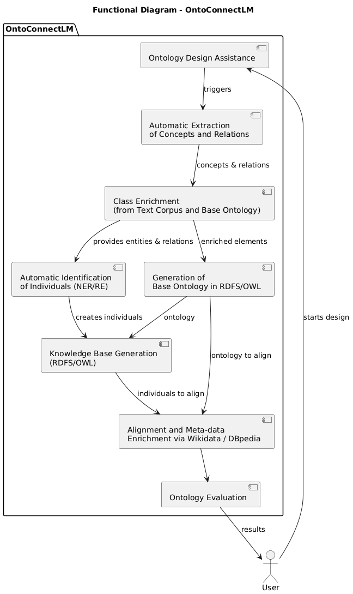

# OntoConnectLM

This component is part of the SMD project platform.

## Description  
OntoConnectLM is a Python library designed to assist domain experts and knowledge engineers in the design, enrichment, and evaluation of ontologies. Leveraging the capabilities of Language Models and open knowledge sources, this module streamlines the automation of several key stages in the ontology lifecycle.

## Functional Objectives of the Component:

• **Ontology Design Assistance**:  
Facilitates the identification of key concepts and relationships from a text corpus, guiding the user in the semantic structuring of knowledge. The component analyzes textual data to automatically detect relevant entities and their relations using advanced natural language processing techniques.

• **Semantic Enrichment**:  
Integrates and enhances extracted concepts from a text corpus and a base ontology by adding relevant semantic information.

• **Automatic Identification of Individuals (Instances)**:  
Based on the identified concepts and relationships, the component performs Named Entity Recognition (NER) to automatically generate individuals linked to the concepts and properties of the ontology. These individuals populate the Knowledge Base (KB), built in parallel with the ontology.

• **Automatic Generation of Ontologies in RDFS/OWL**:  
Generates a formal ontology compliant with Semantic Web standards (RDFS, OWL) from the extracted and validated elements.

• **Alignment and Enrichment Using Public Ontologies**:  
Links the detected concepts to open knowledge bases such as Wikidata and DBpedia to enhance the coherence and reusability of the ontology.

• **Ontology Evaluation**:  
Provides metrics and tools to assess the quality of the generated ontology, following FAIR principles and best practices.

## Functional Diagram

## License
This project is under MPL licence.  
