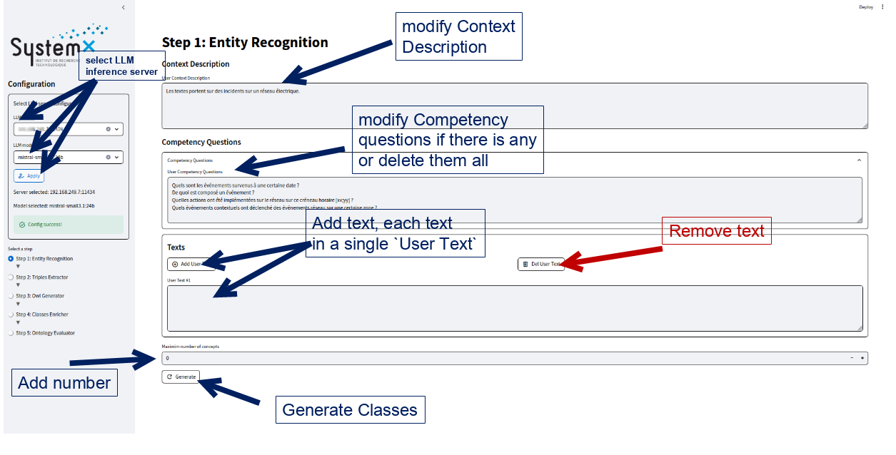
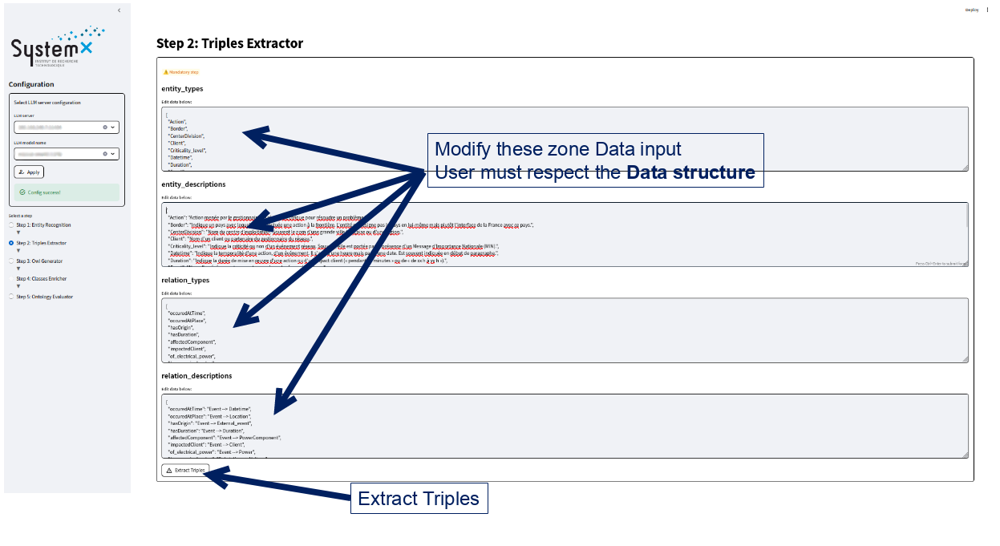
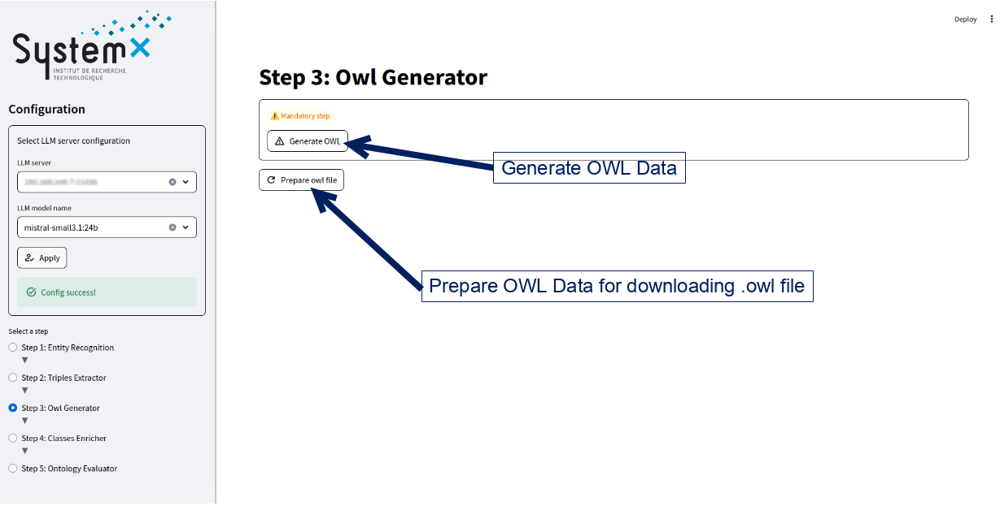
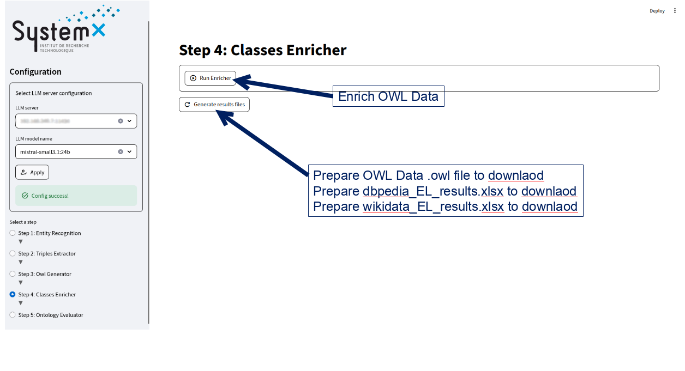
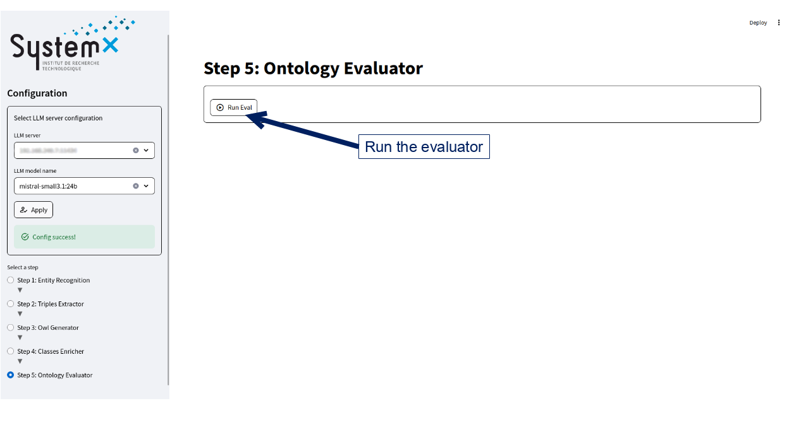

# OntoConnectLM

This code is part of the ANR project [SMD](https://www.irt-systemx.fr/projets/smd/). It is supported by [IRT SystemX](https://www.irt-systemx.fr/)
 
OntoConnectLM is an open source Python library with a web application demo that aims to assist both industrial domain experts and knowledge/AI engineers in the design, enrichment, and evaluation of ontologies. 

## Main features

OntoConnectLM provides end-users with features to:
- Dicover concepts from user's textual entries
- Predict relations and RDF triples  
- Enrich the ontology concepts with external knowledge graphs annotations (Wikidata and DBpedia)
- Generate an ontology file
    - Populated version 
    - Enriched version
- Evaluate the resulted ontology using semantic metrics


## Deployment Instructions  


### Local installation 
1. Clone this projet <OntoconnectLM>
```bash 
git clone https://github.com/IRT-SystemX/OntoconnectLM.git 
cd OntoconnectLM
```
2. install dependencies  
```bash
#create a Python virtual enviroment if neccesary
pip install -r requirements.text
```
3. Run the notebooks: Navigate to the examples/ folder and open the Jupyter notebooks.

### Building docker image  
```bash
# go to ontoconnectlm repo
cd ontoconnectlm

# Build docker image for running the tool and the user interface.
docker build --rm -f ./docker/Dockerfile -t smd:latest .
```

### Run docker image with its application automatically  
by default it will run the application directly.
```bash
docker run --rm -it -p 8501:8501 -v ${PWD}:/ontoconnectlm smd:latest
```

### Run docker image with its application manually  
To do it manually, you can either run the notebooks or run the streamlit application inside the docker container.
```bash
docker run --rm -it -p 8501:8501 -v ${PWD}:/ontoconnectlm smd:latest /bin/bash
```
#### Run notebook  
Run the following command in the container:
```bash
jupyter notebook --allow-root
 ```
Than you need to open the link of jupyternotebook with its token in your favorite web browser.

#### Run streamlit  
Run the following command in the container:
```bash
streamlit run /ontoconnectlm/streamlit/app.py
```

## HMI descriptions  
  
  
  
  


## LLM setup

Ontoconnectlm is available with any llm instance implementing the [Langchain BaseLLM interface](https://python.langchain.com/api_reference/core/language_models/langchain_core.language_models.llms.BaseLLM.html#langchain_core.language_models.llms.BaseLLM).

Langchain is available with [a lot of LLM providers](https://python.langchain.com/docs/integrations/providers/), including Ollama, Huggingface, MistralAI, OpenAI.

### Example with Ollama
`pip install langchain-ollama`

```python
from langchain_ollama import OllamaLLM

base_url = "ollama_base_url:11434"
model_name = "gemma3:12b"

llm = OllamaLLM(base_url = base_url, model=model_name) 
```

### Example with Huggingface

```python
from langchain_huggingface import HuggingFaceEndpoint

repo_id = "google/gemma-3n-E4B-it"

llm = HuggingFaceEndpoint(
    repo_id=repo_id,
    max_length=128,
    temperature=0.5,
    huggingfacehub_api_token=HUGGINGFACEHUB_API_TOKEN,
    provider="auto",  # set your provider here hf.co/settings/inference-providers
)
```


### Example with OpenAI

```python
from langchain_openai import ChatOpenAI

llm = ChatOpenAI(
    model="gpt-4o",
    temperature=0,
    max_tokens=None,
    timeout=None,
    max_retries=2,
    # api_key="...",  
    # base_url="...",
    # organization="...",
    # other params...
)
```

### LLM instance usage

Once your llm is constructured, you can directly pass it as an argument in Ontoconnectlm objects :

```python
from ontoconnectlm.classes_generator import ClassesGenerator

generator = ClassesGenerator(
    llm = llm,
    ...
)
```


## Examples of usage

#### 1. [Test Classes Generator](./examples/test_classes_generator.ipynb)

- Objective: Generate ontology classes based on a given domain context and associated competency questions.
- Steps:
    - Configure LLM object (see section [LLM setup](#llm-setup))
    - Add your texts describing the domain: 
    - Add additional parameters (Optional)
        -   Describe the target domain for which classes could be generated. 
        -   List of competency questions (optional): Enumerate any competency questions that the ontology should address.

- Example: 

    ```python 
        Input = ["""Date and time: 20/04/2012 at 07:11, Impact(s) and action(s) taken: Frequency oscillation detected at the France-Belgium border by IDE.""" ,

        """Date and time: 08/07/2003 at 08h40
        Centre: Essonne
        Structures concerned: Long outage of the Sevran-Beudottes ACR at the WISSOUS 225 kV substation (16 MW for 5 minutes) following tripping of the 225 kV MASSY-PALAISEAU line.
        Impact(s): Cf. MIN."""],

        #Output_list: [Date, Time, 'Event', 'Action', 'Impact', 'Location', 'Client', 'Border']
    ```

#### 2. [Test Triplet Extractor](./examples/test_triplet_extractor.ipynb)  
- Objective: Extract subject-predicate-object triplets from text using a specified LLM model.
- Input: list of texts, Output: list of triples
- Steps:
    - Configure LLM object (see section [LLM setup](#llm-setup))
    - Add your texts from which you wish to extract information:
    - 
-   Example: 
    ```python 
    Input = ["""Date and time: 20/04/2012 at 07:11, Impact(s) and action(s) taken: Frequency oscillation detected at the France-Belgium border by IDE.""" ,

        """Date and time: 08/07/2003 at 08h40
        Centre: Essonne
        Structures concerned: Long outage of the Sevran-Beudottes ACR at the WISSOUS 225 kV substation (16 MW for 5 minutes) following tripping of the 225 kV MASSY-PALAISEAU line.
        Impact(s): Cf. MIN."""],

     #Output_list: Frequency oscillation detection (Event) occuredAtTime 20/04/2012 at 07:11am (DateTime), Frequency oscillation detection (Event) occuredAtPlace Belgium (Location), etc...
    ```

#### 3. [Test OWL Generator](./examples/test_owl_generator.ipynb)
- Objective: Generate an ontology file populated with previously extracted instances.
- Input: List of triples, Output: OWL/RDF file 
- Steps:
    - Indicate a list of triples
    - Specify the classes and properties to be included in the ontology
-Example:
    ```python 
    Input = [
            {'label': 'occuredAtTime',
            'head': "Frequency oscillation detection",
            'head_type': 'Event',
            'tail': '20/04/2012 at 07:11am',
            'tail_type': 'Datetime'}
            ]

    Output = 
    <owl:ObjectProperty rdf:about="#occuredattime"/>
    ....
    <owl:NamedIndividual rdf:about="#Datetime180">
  <rdf:type rdf:resource="#Datetime"/>
  <rdfs:label rdf:datatype="http://www.w3.org/2001/XMLSchema#string">20/04/2012 at 07h11 am</rdfs:label>
     <has_text rdf:datatype="http://www.w3.org/2001/XMLSchema#string">20/04/2012 at 07h11 am</has_text>
    <   /owl:NamedIndividual>
    ....
    <owl:NamedIndividual rdf:about="#Event127">
    <rdf:type rdf:resource="#Event"/>
    <occuredattime rdf:resource="#Datetime180"/>
    <occuredatplace rdf:resource="#GeographicalRegion10"/>
    <rdfs:label rdf:datatype="http://www.w3.org/2001/XMLSchema#string">Frequency oscillation    detection</rdfs:label>
    <has_text rdf:datatype="http://www.w3.org/2001/XMLSchema#string">Frequency oscillation detection</has_text>
    </owl:NamedIndividual>
     The output file should contain: 'occuredattime' as an owl:objectproperty, 'Datetime180' and 'Event127' as owl:NamedIndividual.
    ``` 
    
#### 4. [Test Onto Enricher](./examples/test_classes_enricher.ipynb)
-   Objective: Enrich an existing ontology by adding external knowledge from DBpedia and Wikidata.
    - Steps:
         - Load your ontology by getting its content and, and pass it to the enricher service

    - Output example :


    | Found text | Wikidata Label | Confidence Score
    | :-------- | :----: | :---: |
    | Division : Hauts-de-France | Hauts-de-France (French region) | 0.9987
    | Massive outage occuring on ... | Outage (Electrical event) | 0.989
    | ... the welding process must ... | Welding (machining) | 0.901


#### 5. [Test Onto Evaluator](./examples/test_onto_eval.ipynb)
 - Objective: Evaluate the quality and consistency of an ontology.
-  Steps: 
    - Load your ontology by getting its content and, and pass it to the enricher service

- Output example:


    | Criterion | Importance Level | Sucess | Explanation
    | :--------: | :----: | :---: | :-----
    | Presence of disjointness | MEDIUM | FAILED | No disjointness axioms 
    | Domain and range of properties | MAJOR | PASSED | Every property has a valid domain and range
    | Ontology must be available in HTML format | MINOR | PASSED


## Licence  
This project is under [MPL licence](./LICENSE).  
