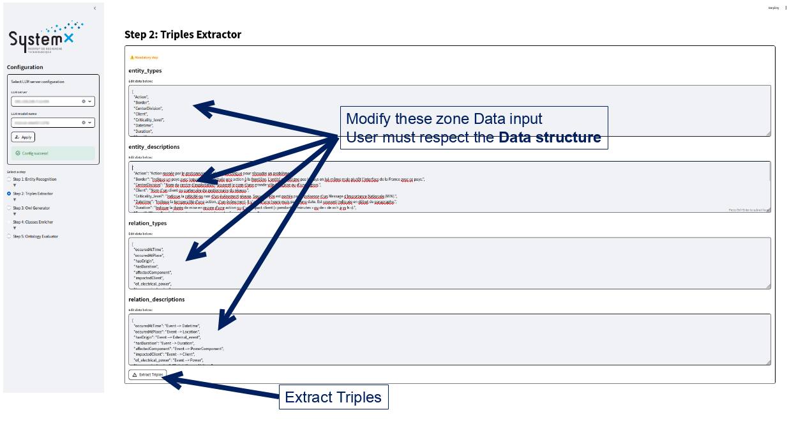

# OntoConnectLM  
This component is part of the SMD project platform.

## Instructions  
### Building docker image  
```bash
# go to ontoconnectlm repo
cd OntoconnectLM

# Build docker image for running the tool and the user interface.
docker build --rm -f ./docker/Dockerfile -t smd:latest .
```

### Run docker image with its application automatically  
by default it will run the application directly.
```bash
docker run --rm -it -p 8501:8501 -v ${PWD}:/ontoconnectlm smd:latest
```

### Run docker image with its application manually  
To do it manually, you can either run the notebooks or run the streamlit application inside the docker container.
```bash
docker run --rm -it -p 8501:8501 -v ${PWD}:/ontoconnectlm smd:latest /bin/bash
```
#### Run notebook  
Run the following command in the container:
```bash
jupyter notebook --allow-root
 ```
Than you need to open the link of jupyternotebook with its token in your favorite web browser.

#### Run streamlit  
Run the following command in the container:
```bash
streamlit run /ontoconnectlm/streamlit/app.py
```

## IHM descriptions  
  
  
  
  


## License
This project is under MPL licence.  
