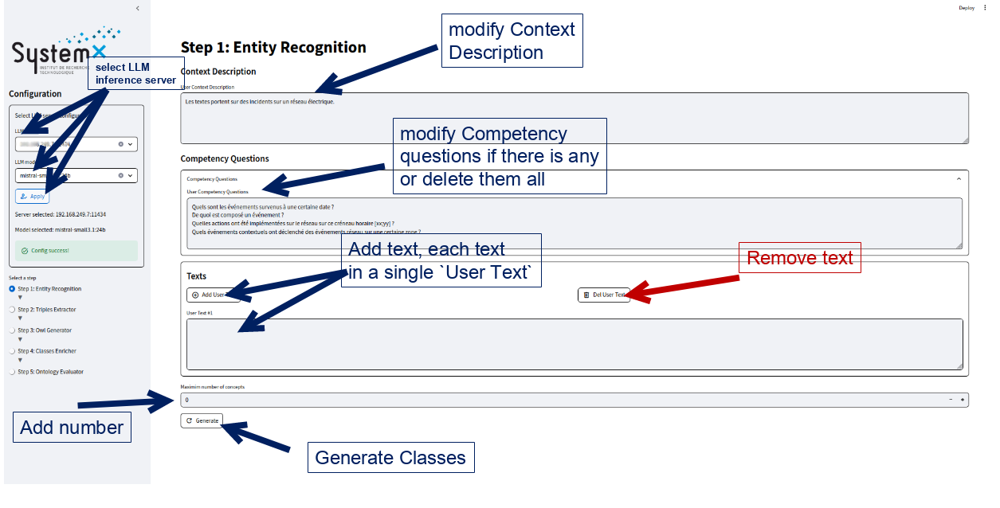
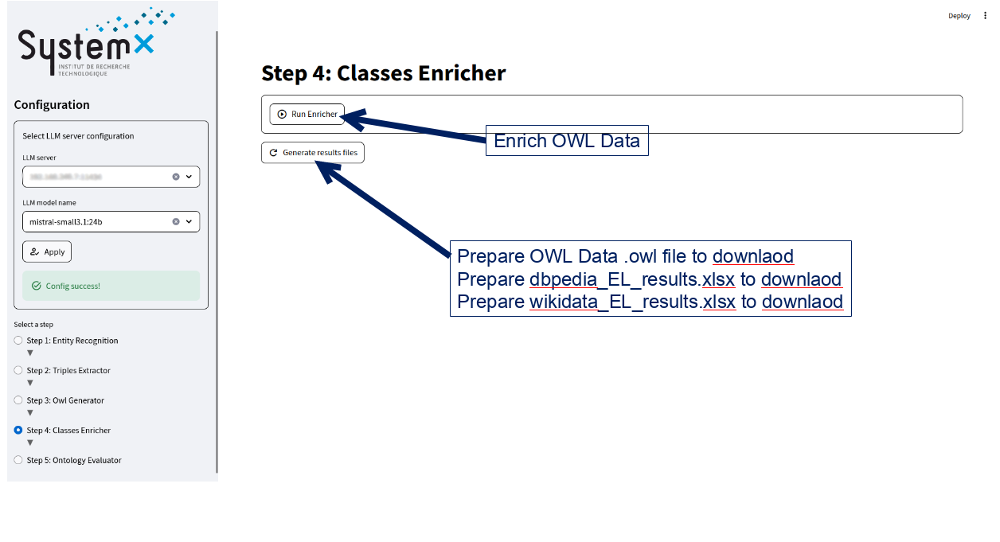
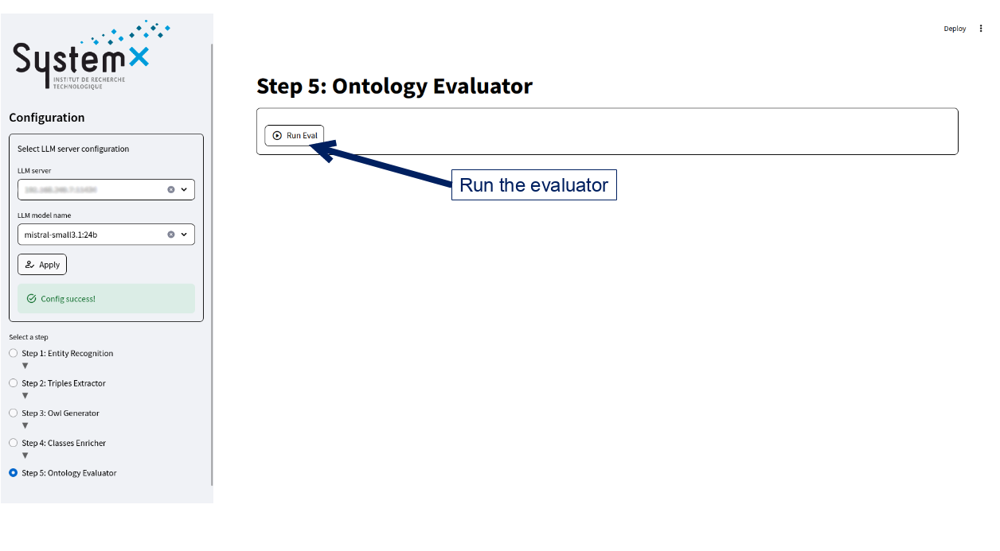

# OntoConnectLM Web UI  
OntoConnectLM Web UI is a streamlit based Web User Interface that allows users to easily interact with the OntoConnect library.

## Instructions  
To run the Web UI, you need to build the Docker image.
If the image has not been built yet, please follow the instructions below to create it and to learn how to run the application.

```bash
# Go to OntoconnectLM repo.
cd OntoconnectLM

# Build docker image.
docker build --rm -f ./docker/Dockerfile -t smd:latest .
```

### Run docker image with its application automatically ***(RECOMMENDED)***  
By default it will run the application directly.
```bash
docker run --rm -it -p 8501:8501 -v ${PWD}:/ontoconnectlm smd:latest
```

### Run docker image with its application manually  
In case you need to debug, you can either run the notebooks or run the streamlit application inside the docker container manually.
```bash
# Run the docker container on your local terminal
docker run --rm -it -p 8501:8501 -v ${PWD}:/ontoconnectlm smd:latest /bin/bash

# Run the following notebook command in the container
jupyter notebook --allow-root

# Run the following streamlit command in the container
streamlit run /ontoconnectlm/app.py
```
> **<u>NOTE:</u>** Than you need to open the link of jupyternotebook with its token and/or the streamlit link in your favorite web browser.


## Web UI descriptions  
  
  
  
  


